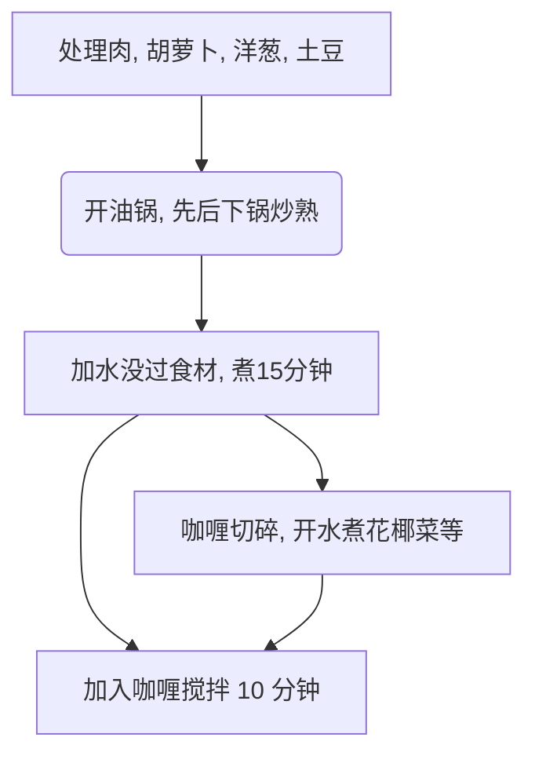

# How to Make Japanese Curry Rice

Estimated Cooking Difficulty: ★★★★

## Essential Ingredients and Tools

### Main Ingredients

- Curry roux blocks (Hodo brand recommended)
- Potatoes
- Carrots
- Onions
- Meat (pork, chicken, or beef)
- Garlic cloves

### Secondary Ingredients

Optional ingredients for garnish

- Cauliflower (boiled in water)
- Bacon (ready-to-eat)
- Fried egg or [Sunny-side-up egg](../../breakfast/太阳蛋.md)

## Proportions

Ingredient quantities are proportional to the amount of curry roux. This guide uses **half a box of Hodo curry blocks (115g)** as an example. Half a box serves approximately six bowls. The curry tastes even better after being refrigerated, so don't worry about not finishing it all in one sitting.

- 2 Onions
- 2 Potatoes
- 1 Carrot
- 2-3 Garlic cloves
- 1 kg (2 jin) Meat

## Instructions

### 1. Ingredient Preparation

- Trim the ends of the carrots, peel them, and cut into chunks.
- Peel the outer layers of the onions, remove the core, and slice into crescent shapes.
- Peel the potatoes and cut into large chunks.
- Cut the meat into bite-sized pieces.
- Peel the garlic, flatten, and mince.
- Break the curry blocks into small pieces to increase surface area and speed up dissolution.

### 2. Cooking Process

- Heat oil in a pan, add garlic and meat, and **stir-fry quickly** until the meat *turns white on the surface*.
- Add the carrots and **stir-fry quickly** until evenly heated.
- Add the onions and **stir-fry quickly** until the onions *become translucent*.
- Add the potatoes and continue stirring until the potatoes *become soft* (you can check with chopsticks).
- Add enough water to cover all ingredients. Once boiling, **wait for 15 minutes**.
- Turn off the heat, add the curry blocks, and stir.
- Once the curry has melted, turn the heat back on and **stir slowly for 10 minutes** to prevent sticking.
- Remove from heat when the mixture *reaches a thick, viscous consistency*.

### 3. Reheating After Refrigeration

Take out the desired portion of the refrigerated curry, reheat it, and serve over [Rice](../米饭/电饭煲蒸米饭.md).

- Microwave: High power for 2-3 minutes per serving.
- Stovetop: Add an extra 50ml of water and stir continuously while heating.

## Additional Information

### Notes

- Steps 1-6 can be performed during the waiting period of steps 2-5 to 2-6. You can also boil some vegetables in plain water or make a fried egg during this time.
- Between steps 2-5 and 2-6, monitor the water level. If the water drops below the 2/3 mark of the ingredients, add hot water to cover them again.

### Flowchart

### Finished Product

### References

- [Weibo Video from World Cuisine Tutorials](http://t.cn/EJ77yFy)

---
If you encounter any issues or have suggestions for improving the process by following this guide, please open an Issue or submit a Pull Request.
