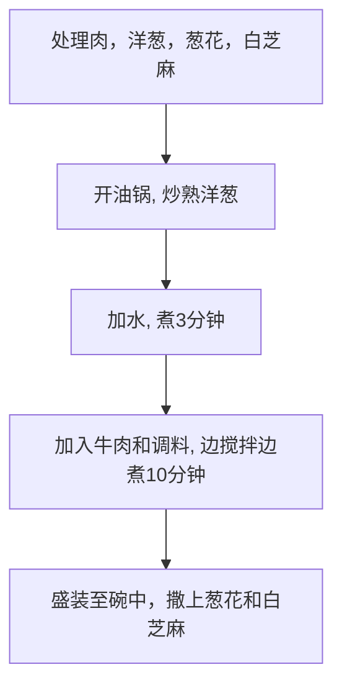

# How to Make Japanese Gyu-don

Estimated Cooking Difficulty: ★★★★

## Essential Ingredients and Tools

### Main Ingredients

- Onion (Be sure to use onions with white-yellow skin; do not use purple onions)
- Fatty beef (Hot pot-style fatty beef is fine, or you can use original-cut beef slices)
- Green onion (Pre-cut green onion segments can also be used)
- White sesame seeds
- Mirin (A common Japanese seasoning available on major e-commerce platforms; cooking wine can be used as a substitute)

### Secondary Ingredients

Optional ingredients for garnish

- [Onsen Egg](../../breakfast/Onsen%20Egg/Onsen%20Egg.md)
- Dashi (Broth made from dried bonito flakes and kelp, used to enhance umami)

## Calculations

Ingredient quantities are proportional to the amount of rice. The calculations below use **one cup of rice (160ml)** as an example. This is approximately enough for two people. Leftovers can be stored in the refrigerator, though the taste may not be as good.

- 1 Onion
- 250g Fatty beef
- 1~2 Green onions
- 5g White sesame seeds

## Instructions

### 1. Ingredient Preparation

- Peel the outer layer of the onion, remove the core, and slice it into crescent shapes.
- Wash the green onions and cut them into 0.5cm pieces.
- Heat a pan and add the white sesame seeds. **Shake the pan back and forth** to evenly toast the seeds until they are *lightly golden*.
- Blanch the fatty beef for 1 minute, then remove and drain.
- Mix 40g of `mirin` (or 30g of `cooking wine`), 30g of `soy sauce`, 20g of `oyster sauce`, 5g of `sugar`, and 5g of `dark soy sauce` (optional, for color) in a bowl to create the `sauce` (you can place the bowl directly on a digital scale for this step).

### 2. Cooking Process

- Heat oil in a pan and add the onions. **Stir-fry quickly** until the onions *become translucent*.
- Reduce the heat to low, add 250g of water (or dashi), then increase the heat to high and **wait for 3 minutes**.
- Add the beef and the `sauce`.
- **Constantly stir** all ingredients for **10 minutes** to prevent them from sticking to the pan.
- Turn off the heat.
- Serve the gyu-don over [rice](../Rice/Rice%20in%20Rice%20Cooker.md) (be sure to pour some of the sauce over the rice).
- Sprinkle with chopped green onions and white sesame seeds. Done.

### 3. Reheating After Refrigeration

Take out the desired portion of the refrigerated gyu-don, reheat it, and serve it over [rice](../Rice/Rice%20in%20Rice%20Cooker.md).

- Microwave: High power for 2-3 minutes for a single serving.
- Stovetop: Add an extra 50ml of water and **stir constantly** while heating.

## Additional Content

```shell
struct Staple{float 咸度;};
struct Staple 牛丼
牛丼.咸度 = 尝一口汤汁;
while(牛丼.咸度 < 预期) 加入(1 g)酱油; 牛丼.咸度 = 尝一口汤汁;
```

### Notes

- If using high-quality beef, you can skip blanching to better preserve its flavor. Since mirin is added, the gamey taste will be minimized, so there's no need to worry about the beef being undercooked. Heating for 10 minutes is sufficient to cook it through.
- If possible, add 15g of sake.

### Flowchart



### Final Product


### References

- [He Shui Yangyang Lab [Beef Bowl | Beef Rice Bowl] Authentic Recipe for Yoshinoya Beef Rice](https://www.bilibili.com/video/BV1rK4y1d7Fk)
- [Uncle Xia's Kitchen Prepare a Divine Recipe in 60 Seconds, Delicious and Appetizing Beef Rice!](https://www.bilibili.com/video/BV1xu4y1676X)

---
If you encounter any issues or have suggestions for process improvements while following this guide, please open an Issue or submit a Pull request.
