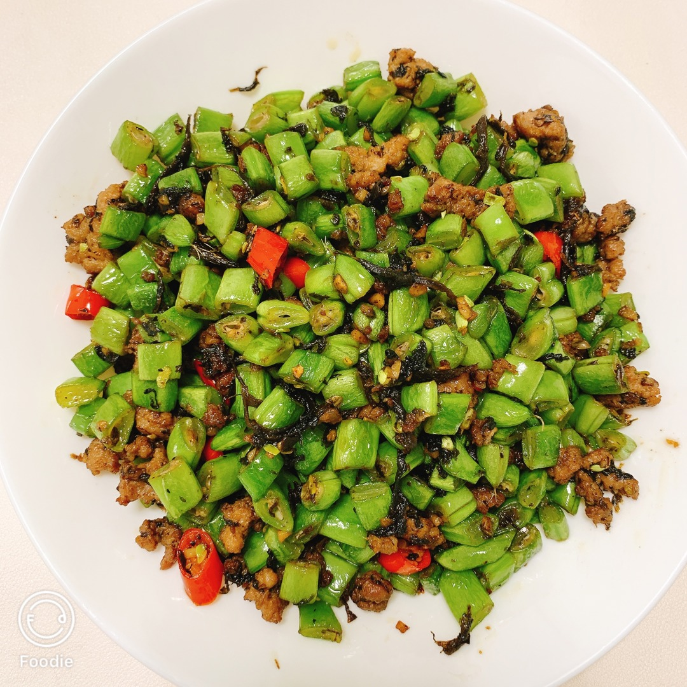

# Recipe for Green Beans with Minced Pork and Preserved Vegetables

Estimated Cooking Difficulty: ★★★

## Required Ingredients and Tools

* Green beans
* Pork belly
* Preserved vegetables (Lan cai)
* Garlic
* Thai chili peppers (omit if you don't like spicy food)

## Measurements

* Green beans: 220g
* Pork belly: 100g
* Preserved vegetables: 20g
* Garlic: 10g
* Thai chili peppers: 10g

## Instructions

* Wash the green beans, remove the tough strings, and cut them into uniform pieces. Set aside.
* Crush and mince the garlic. Set aside.
* Cut the Thai chili peppers into uniform pieces. Set aside.
* Peel the pork belly and mince it. Set aside.
* Heat the wok, add 20ml of oil to coat the surface, then pour out the hot oil. Add 10ml of cold oil. This is the "hot wok, cold oil" technique, which helps prevent the minced pork from sticking to the pan.
* If you don't have a bottle for straining oil, you can skip this step. Simply add oil to the pan, add the minced pork, and stir-fry over low heat for two minutes to render the fat.
* Once the minced pork is fragrant, add the minced garlic, preserved vegetables, and Thai chili peppers. Stir-fry until fragrant.
* Add the green beans and stir-fry over medium heat for at least 5 minutes. Ensure the green beans are **fully cooked** to avoid food poisoning.
* Once the green beans are cooked, drizzle 2ml of soy sauce along the edge of the wok. Add 2g of salt, 1g of chicken bouillon powder, 1g of ground pepper, and 0.5g of sugar.
* Toss everything together to evenly distribute the seasonings.
* Remove from heat and plate.

## Additional Information

If you encounter any issues or have suggestions for improvement while following this guide, please submit an Issue or Pull request.
